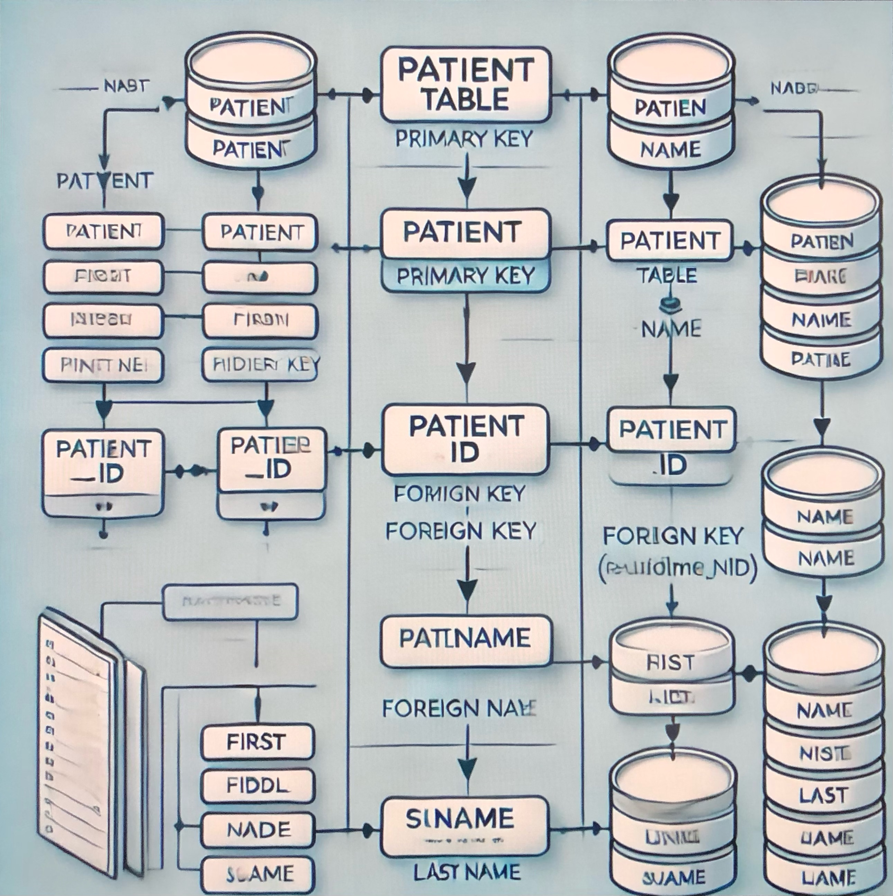

# About

What better way to illustrate my OpenAPI doc explorations than by building a fully functional REST service that auto-generates and serves integrated OAS documentation?

# Usage
I'm not here to tell you what to do, but I _can_ help you figure out how to do it.

## Command Line Parsing
This service uses [clap](https://github.com/clap-rs/clap?tab=readme-ov-file) for argument parsing. The clap crate works with cargo, but you'll need slightly modified syntax when running options with no commands. For example, `api-doc -h` or `cargo run -- -h` provides a list of top-level commands and options, and `api-doc <command> -h` or `cargo run <command> -h` returns information for a specific command.

## OAS Documentation
The original project goal was to explore working with OAS documentation. At the heart of this project is an integrated web UI experience that provides documentation and interactive testing functionality. 

Spinning the project up from a cold start requires a Rust install and some data persistence layer available. See my writeup on [headyimage]() for a cursory guide on project setup.

If you already have PostgreSQL and Rust installed, and generally already know what you're doing, you can simply run 
 `cargo install --git https://github.com/p5chmitz/api-doc` to clone, compile, and install the requisite binaries. 

Once you've got the project up you can:

1) Use the `createuser` command to create a user. The parser provides syntax details with the `<executable> createuser -h` help menu.

2) Run the `serve` command to start the server. For local deployments with no custom configurations navigate to `127.0.0.1:8080/v1/swagger-ui` in your browser to use the Swagger UI. The parser provides additional configuration options with the `<executable> serve -h` help menu, though initially the project just allows you to specify the server port.

3) All endpoints but the login endpoint require an auth token. Use your newly created user credentials to obtain an auth token from the login endpoint. To set the auth header for subsequent endpoint calls use Swagger's Authorize functionality button and click "Authorize".
